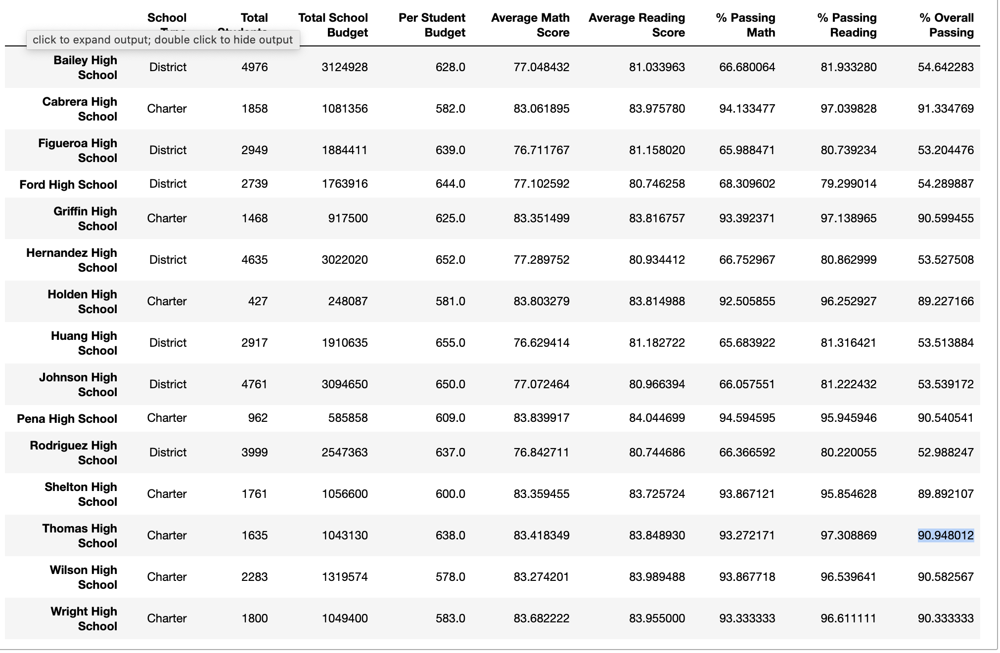
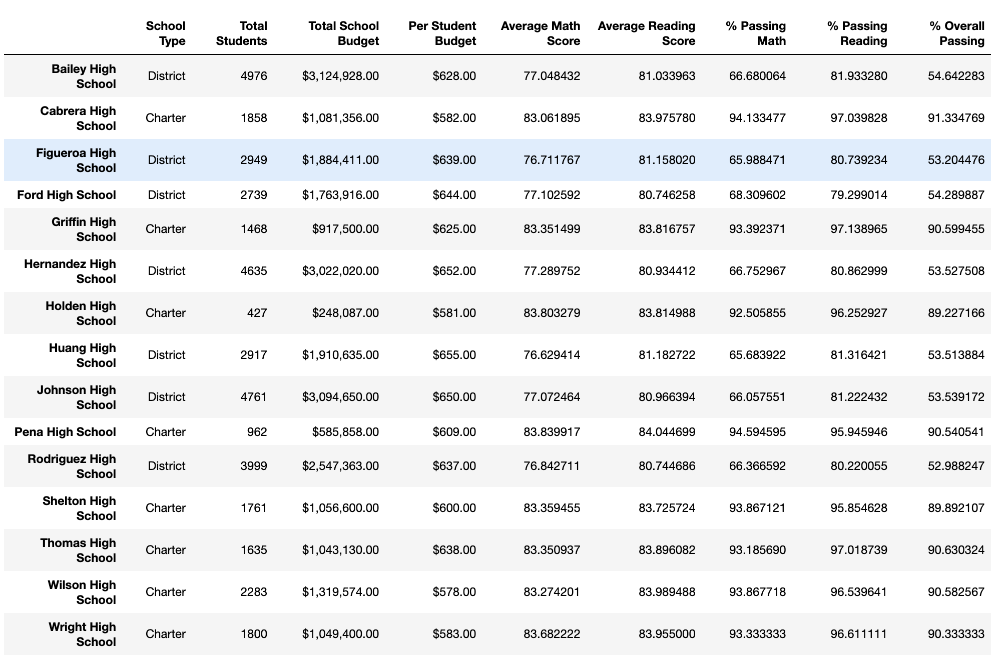
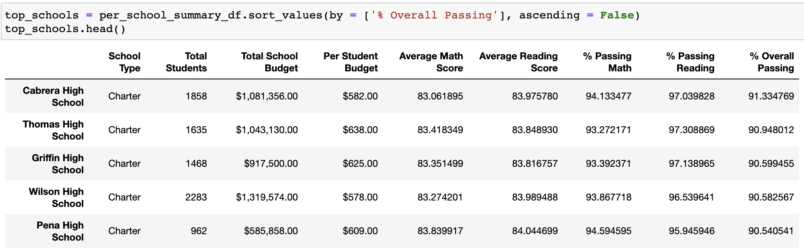
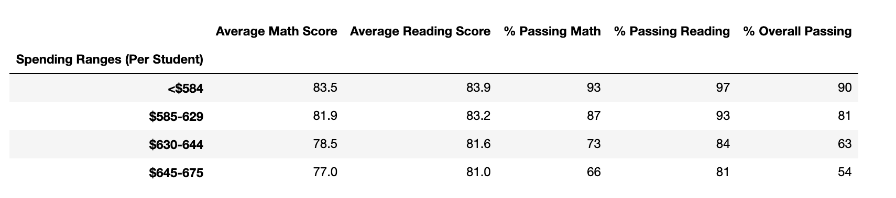
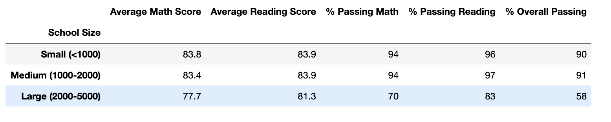
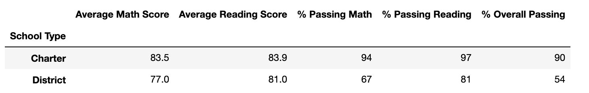

# School_District_Analysis

## Overview of School District Analysis

In this project, the goal was to analyze the data from one school district in order to create a more tranparent view on what could cause differences in the performance of each school. As part of this, we looked into math and reading scores by grade, how fnding affects math and reading scores, how school size affects math and reading scores, and how school type affects math and reading scores. Additionally, in order to uphold academic honesty standards, this analysis was conducted twice to account for academic dishonesty within the 9th grade of Thomas High school.  

## Results

### How is the district summary affected?
As you can see from the screenshots below, the district scores were slightly lower without the data from the 9th graders at Thomas High School. Without the 9th graders, the average math score dropped by .1, the average reading remained the same, hte % passing math was 1.2% lower, the % passing reasing was .3% lower and the over passing was .1% lower.

Including Thomas High School 9th Grade:

Not Including Thomas High School 9th Grade:

### How is the school summary affected?
As you can see from the screenshots below, the school summary scores were slightly different without the data from the 9th graders at Thomas High School. Without the 9th graders, the average math score dropped by .06, the average reading rose by .05, the % passing math was .08% lower, the % passing reading was 3% higher and the over passing was .3% lower.

Including Thomas High School 9th Grade:

Not Including Thomas High School 9th Grade:

### How does replacing the ninth graders’ math and reading scores affect Thomas High School’s performance relative to the other schools?

The ranking of Thomas High School was not strongly affected by the inclusion of the dishonest 9th grade data. Either way, Thomas High School is the 2nd to best school in the district. 

Including Thomas High School 9th Grade:

Not Including Thomas High School 9th Grade:

### How does replacing the ninth-grade scores affect the following:

**Math and reading scores by grade:** The Math and reading scores are unchanged when the 9th graders from Thomas High School are removed. There is simply an NaN in the 9th grade column.

**Scores by school spending:** When looking at the data including and not including the ninth graders, the change did not impact the average math or reading score by school spening. Additionally, the Average scores for passing math and reading do not increase as spending increases. If you look at the top performing school, Cabrera high School, you can see that it received the lowest bidget per student. In fact, it seems as though as budget increases, overall passing percentages decrease.

    
**Scores by school size:** For the school summary, removing the 9th graders did not change the average math score or average reading scores, but it did affect the passing percentages. Specifically, for schools with 1000-2000 students, the % passing math, reading, and overall dropped by .6%. 

    
**Scores by school type:** Similarly to the school sizes, removing the 9th graders did not affect the average scores but it did affect the passing percentages. If the 9th graders are included, the charter schools had a higher % passing math, % passing reading, and % overall passing. 

    
## Summary

Summarize four changes in the updated school district analysis after reading and math scores for the ninth grade at Thomas High School have been replaced with NaNs.

1. Replacing the 9th grade grades with NaN caused the average scores and passing percentages to drop significantly.  
2. The general district scores and passing rates dropped slightly without the 9th grade grades. 
3. Not including the 9th grade grades caused Thomas High School to become the 8th to best school in the district. But, when the total student count was updated to reflect the exclusion of the 9th grade, Thomas High School stayed in the 2nd best position. 
4. In general, removig the 9th graders caused the % passing by school size and type to drop but did not change the average math and reading scores. 