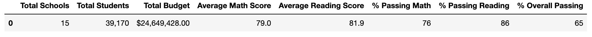
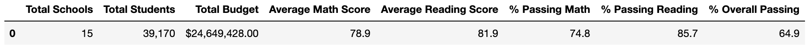

# School_District_Analysis

## Overview of School District Analysis

In this project, the goal was to analyze the data from one school district in order to create a more tranparent view on what could cause differences in the performance of each school. As part of this, we looked into math and reading scores by grade, how fnding affects math and reading scores, how school size affects math and reading scores, and how school type affects math and reading scores. Additionally, in order to uphold academic honesty standards, this analysis was conducted twice to account for academic dishonesty within the 9th grade of Thomas High school.  

## Results

- How is the district summary affected?
As you can see from the screenshots below, the district scores were slightly lower without the data from the 9th graders at Thomas High School. Without the 9th graders, the average math score dropped by .1, the average reading remained the same, hte % passing math was 1.2% lower, the % passing reasing was .3% lower and the over passing was .1% lower.

Including Thomas High School 9th Grade:

Not Including Thomas High School 9th Grade:

- How is the school summary affected?
- How does replacing the ninth graders’ math and reading scores affect Thomas High School’s performance relative to the other schools?
- How does replacing the ninth-grade scores affect the following:
    - Math and reading scores by grade
    - Scores by school spending
    - Scores by school size
    - Scores by school type
    
## Summary

Summarize four changes in the updated school district analysis after reading and math scores for the ninth grade at Thomas High School have been replaced with NaNs.